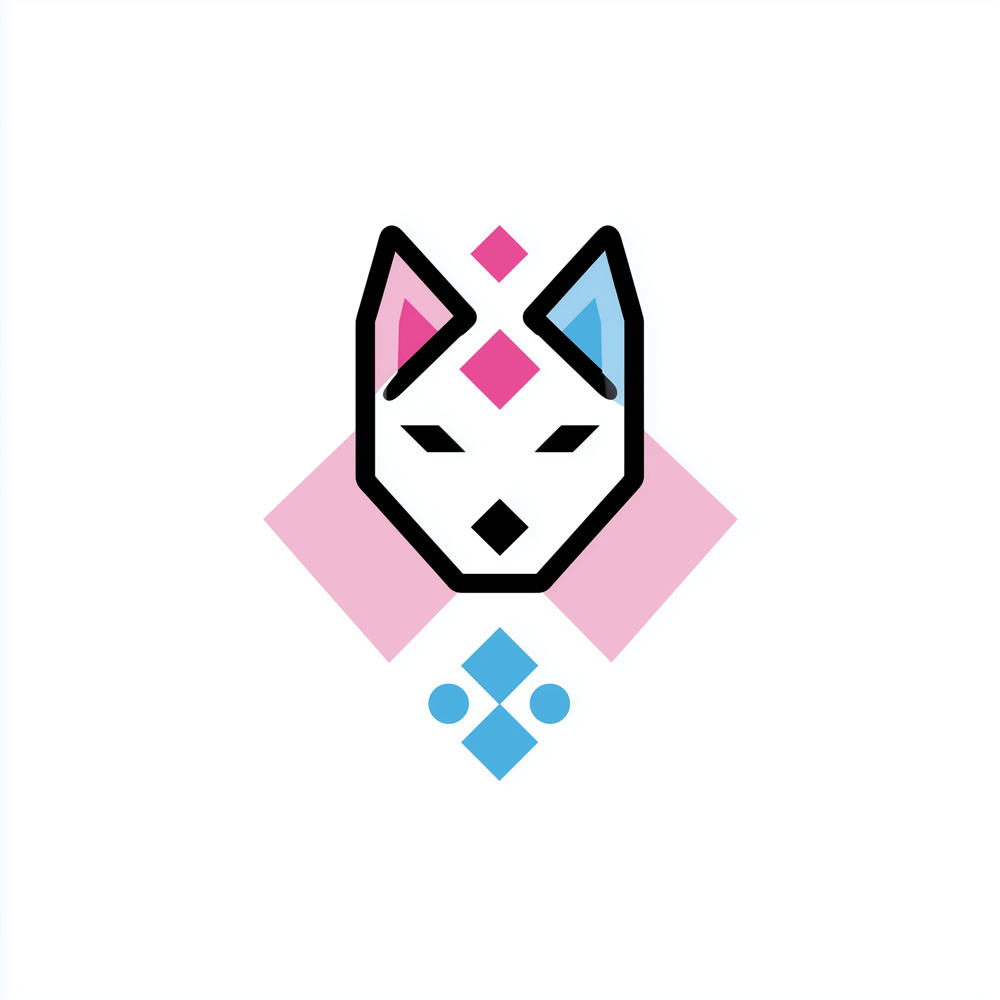

# 🌀 Gozjaro Linux

Welcome to the **official GitHub organization of Gozjaro Linux** — a minimalist, elegant, and fully customizable Linux distribution built from scratch, powered by [Pacman](https://wiki.archlinux.org/title/Pacman).

Gozjaro is not just a distro. It's a **blank canvas** for developers, power users, and curious minds who want to build their systems from the ground up — with full control, high performance, and no unnecessary bloat.

---

## 🌟 What is Gozjaro?

Gozjaro Linux is:

- **Built from LFS** (Linux From Scratch)
- Uses **Pacman** as the package manager
- Ships as a **terminal-only ISO**
- **Desktop Environment agnostic** — you choose what to install
- Aimed at **power users and developers**
- **Community-driven** and open to contributions
- A place where ideas are **inspired, empowered, curious, and confident**

> Whether you're building a lightweight dev environment, a custom desktop, or a headless server — Gozjaro gives you the freedom and tools to shape your experience.

---

## 🚀 Project Goals

- ⚙️ Provide a flexible, simple Linux base for customization
- 🧩 Build a powerful and minimal package ecosystem with `pacman`
- 🌐 Foster an open, inclusive, and welcoming community
- 📚 Encourage learning through doing — inspired by the DIY spirit
- 🔧 Develop tools and scripts to make customization easier
- 📦 Create and maintain official Gozjaro packages and repositories

---

## 📁 Repositories

Explore our work:

- [`gozjaro-bootstrap`](https://github.com/Gozjaro/gozjaro-bootstrap): Bootstrap scripts for building Gozjaro from LFS
- [`gozjaro-pkgs`](https://github.com/Gozjaro/gozjaro-pkgs): Gozjaro package build recipes and source tracking
- [`gozjaro-iso`](https://github.com/Gozjaro/gozjaro-iso): Scripts and configs for generating the Gozjaro ISO
- *(More coming soon...)*

---

## 🙌 Join the Community

We believe in building together. You’re welcome to:

- Report issues
- Contribute code and documentation
- Propose features
- Join discussions and planning
- Help newcomers in our future forums or chat

**Stay tuned — our community spaces are coming soon!**

---

## 📜 License

All projects in this organization follow **open source licenses**. Each repository specifies its own license (typically MIT or GPL).

---

## ✨ Slogan Ideas

> *"Minimal by default, powerful by design."*  
> *"Your system. Your rules."*  
> *"Built from scratch, powered by choice."*

---

> **Gozjaro Linux** — Build. Customize. Explore.

[简体中文](README.zh-cn.md)
